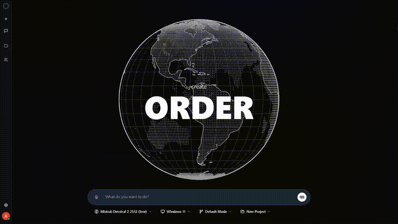

# Pantheon

Enterprise-grade AI backend system with Windows VM integration, multi-model AI support, and OAuth authentication.

## Platform Demo



The demo shows the complete Pantheon platform including project creation, Windows VM management, and AI model integration.

## Table of Contents

- [Overview](#overview)
- [Features](#features)
- [Architecture](#architecture)
- [Prerequisites](#prerequisites)
- [Quick Start](#quick-start)
- [Installation Guide](docs/INSTALLATION.md)
- [Configuration](docs/CONFIGURATION.md)
  - [Environment Setup](docs/CONFIGURATION.md#environment-setup)
  - [Keycloak Configuration](docs/KEYCLOAK_SETUP.md)
  - [Model Configuration](docs/MODEL_CONFIGURATION.md)
- [Deployment Guide](DEPLOYMENT.md)
- [Usage Guide](docs/USAGE.md)
- [API Documentation](docs/API.md)
- [Network Architecture](docs/NETWORK.md)
- [Troubleshooting](docs/TROUBLESHOOTING.md)
- [Contributing](#contributing)
- [License](#license)

## Overview

Pantheon is a comprehensive AI backend platform designed for enterprise deployments. It provides a unified interface for multiple AI models, secure Windows VM management, and enterprise-grade authentication.

### Key Capabilities

- **Multi-Model AI Integration**: Seamlessly integrate with OpenRouter, Google Gemini, OpenAI, and Anthropic
- **Windows VM Management**: Create and manage isolated Windows 11 environments for AI agents
- **Enterprise Authentication**: OAuth 2.0 via Keycloak with support for Google, Microsoft, and custom providers
- **Secure Architecture**: Network isolation, encrypted communications, and row-level security
- **Scalable Design**: Docker-based deployment with horizontal and vertical scaling support

## Features

### Core Features

| Feature | Description | Documentation |
|---------|-------------|---------------|
| Multi-Model AI | Support for 100+ AI models through unified API | [Model Configuration](docs/MODEL_CONFIGURATION.md) |
| Windows VM | Isolated Windows 11 VMs with MCP protocol | [Usage Guide](docs/USAGE.md) |
| Authentication | OAuth 2.0 with Keycloak | [Keycloak Setup](docs/KEYCLOAK_SETUP.md) |
| Database | PostgreSQL with automatic migrations | [Installation Guide](docs/INSTALLATION.md) |
| Network Isolation | Project-based network segmentation | [Network Architecture](docs/NETWORK.md) |
| API Management | User-specific API keys with usage tracking | [API Documentation](docs/API.md) |

### Technical Features

- Docker containerization with health monitoring
- Static IP addressing for reliable service discovery
- Multi-homed containers for cross-network communication
- Automatic database schema migrations
- Real-time collaboration via WebSocket
- Comprehensive audit logging
- Encrypted API key storage

## Architecture

### System Overview

```
┌─────────────────────────────────────────────────────────────┐
│                     Main Network (10.0.1.0/24)              │
│                                                             │
│  ┌──────────┐  ┌──────────┐  ┌──────────┐  ┌──────────┐  │
│  │ Frontend │  │ Backend  │  │ Keycloak │  │ Postgres │  │
│  │ :3000    │  │ :3002    │  │ :8080    │  │ :5432    │  │
│  └──────────┘  └──────────┘  └──────────┘  └──────────┘  │
│                                                             │
└─────────────────────────────────────────────────────────────┘
                           │
                           │ Multi-homed Bridge
                           ▼
┌─────────────────────────────────────────────────────────────┐
│              Project Network (172.30.x.0/24)                │
│                      (Isolated per Project)                 │
│                                                             │
│  ┌──────────┐  ┌──────────┐  ┌──────────┐  ┌──────────┐  │
│  │ Windows  │  │  Shared  │  │  Tools   │  │ Backend  │  │
│  │   VM     │  │  Folder  │  │   API    │  │(bridge)  │  │
│  └──────────┘  └──────────┘  └──────────┘  └──────────┘  │
│                                                             │
└─────────────────────────────────────────────────────────────┘
```

For detailed architecture information, see [Network Architecture](docs/NETWORK.md).

## Prerequisites

### System Requirements

- **Operating System**: Windows 10/11, macOS 10.15+, or Linux (Ubuntu 20.04+)
- **Docker**: Docker Desktop 4.0+ or Docker Engine 20.10+
- **Memory**: 8GB RAM minimum, 16GB recommended
- **Storage**: 50GB free disk space
- **Network**: Internet connection for pulling images and API access

### Required Accounts

| Service | Purpose | Sign Up Link |
|---------|---------|--------------|
| DockerHub | Pull container images | [hub.docker.com](https://hub.docker.com) |
| OpenRouter | Multi-model AI access | [openrouter.ai](https://openrouter.ai) |
| Google AI Studio | Gemini API access | [makersuite.google.com](https://makersuite.google.com/app/apikey) |

### Optional Accounts

| Service | Purpose | Sign Up Link |
|---------|---------|--------------|
| OpenAI | GPT models | [platform.openai.com](https://platform.openai.com) |
| Anthropic | Claude models | [console.anthropic.com](https://console.anthropic.com) |

## Quick Start

### 1. Clone Repository

```bash
git clone https://github.com/akilhassane/pantheon.git
cd pantheon
```

### 2. Configure Environment

```bash
# Copy environment template
cp .env.example .env

# Edit with your API keys
nano .env  # Linux/Mac
notepad .env  # Windows
```

Required configuration:
```env
OPENROUTER_API_KEY=your_openrouter_key_here
GEMINI_API_KEY=your_gemini_key_here
MCP_MASTER_SECRET=generate_random_64_character_string
POSTGRES_PASSWORD=secure_database_password
```

### 3. Deploy

**Windows:**
```powershell
.\deploy.ps1
```

**Linux/Mac:**
```bash
chmod +x deploy.sh
./deploy.sh
```

### 4. Access Services

- **Frontend**: [http://localhost:3000](http://localhost:3000)
- **Backend API**: [http://localhost:3002](http://localhost:3002)
- **Keycloak Admin**: [http://localhost:8080](http://localhost:8080)
  - Username: `admin`
  - Password: `admin` (change in production)

### 5. Uninstall (The Doofenshmirtz)

To completely remove Pantheon from your system:

**Windows:**
```powershell
.\the-doofenshmirtz.ps1
```

**Linux/Mac:**
```bash
chmod +x the-doofenshmirtz.sh
./the-doofenshmirtz.sh
```

Options:
- `--keep-images`: Keep Docker images
- `--keep-volumes`: Keep data volumes (preserves database)
- `--force`: Skip confirmation prompt

### 6. Next Steps

1. [Configure Keycloak OAuth providers](docs/KEYCLOAK_SETUP.md)
2. [Set up AI models](docs/MODEL_CONFIGURATION.md)
3. [Create your first project](docs/USAGE.md)

## Documentation

### Getting Started

- [Installation Guide](docs/INSTALLATION.md) - Complete installation instructions
- [Configuration Guide](docs/CONFIGURATION.md) - Environment and service configuration

### Configuration

- [Keycloak Setup](docs/KEYCLOAK_SETUP.md) - OAuth provider configuration
- [Model Configuration](docs/MODEL_CONFIGURATION.md) - AI model setup and selection

### Usage

- [Usage Guide](docs/USAGE.md) - Complete user guide
- [API Documentation](docs/API.md) - REST and WebSocket API reference

### Operations

- [Troubleshooting](docs/TROUBLESHOOTING.md) - Common issues and solutions

## Contributing

We welcome contributions! To contribute:

1. Fork the repository
2. Create a feature branch
3. Make your changes
4. Submit a pull request

Please ensure your code follows the existing style and includes appropriate tests.

## License

This project is licensed under the MIT License. See the [LICENSE](LICENSE) file for details.

## Support

### Getting Help

- **Documentation**: [GitHub Wiki](https://github.com/akilhassane/pantheon/wiki)
- **Issues**: [GitHub Issues](https://github.com/akilhassane/pantheon/issues)
- **Discussions**: [GitHub Discussions](https://github.com/akilhassane/pantheon/discussions)

### Reporting Issues

When reporting issues, please include:

1. System information (OS, Docker version)
2. Steps to reproduce
3. Expected vs actual behavior
4. Relevant logs
5. Configuration (sanitized)

## Acknowledgments

- [OpenRouter](https://openrouter.ai) - Multi-model AI access
- [Keycloak](https://www.keycloak.org) - Identity and access management
- [Docker](https://www.docker.com) - Containerization platform
- [PostgreSQL](https://www.postgresql.org) - Database system
- [Next.js](https://nextjs.org) - React framework

## Project Status

- **Version**: 1.0.0
- **Status**: Production Ready
- **Last Updated**: 2026-02-23
- **Maintained**: Yes
