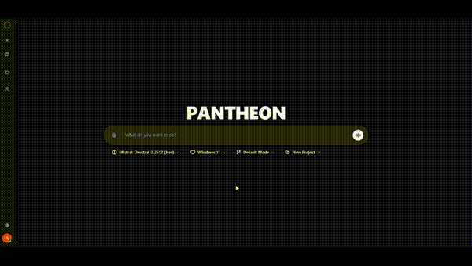

# Keycloak Setup Guide

Complete guide for configuring Keycloak authentication and OAuth providers.



## Table of Contents

- [Overview](#overview)
- [Initial Setup](#initial-setup)
- [OAuth Provider Configuration](#oauth-provider-configuration)
  - [Google OAuth](#google-oauth)
  - [Microsoft OAuth](#microsoft-oauth)
- [Client Configuration](#client-configuration)
- [User Management](#user-management)
- [Advanced Configuration](#advanced-configuration)
- [Troubleshooting](#troubleshooting)

## Overview

Keycloak provides enterprise-grade authentication for Pantheon. This guide covers:

- Initial Keycloak configuration
- OAuth provider setup (Google, Microsoft)
- Client application configuration
- User management and roles
- Session management

## Initial Setup

### Access Keycloak Admin Console

1. Navigate to [http://localhost:8080](http://localhost:8080)
2. Click "Administration Console"
3. Login with credentials:
   - Username: `admin`
   - Password: `admin` (or value from `KEYCLOAK_ADMIN_PASSWORD`)

### Change Admin Password

For production deployments:

1. Click "Admin" (top right) → "Manage account"
2. Navigate to "Password"
3. Enter current password: `admin`
4. Enter new secure password
5. Click "Save"

### Realm Configuration

Pantheon uses the `master` realm by default.

**To verify realm settings:**

1. Select "master" realm (top left dropdown)
2. Navigate to "Realm settings"
3. Verify:
   - Display name: `master`
   - Enabled: `ON`
   - User registration: `OFF` (enable if needed)
   - Email as username: `OFF`
   - Login with email: `ON`

## OAuth Provider Configuration

### Google OAuth

#### Step 1: Create Google OAuth Credentials

1. Visit [Google Cloud Console](https://console.cloud.google.com/apis/credentials)
2. Create new project or select existing
3. Navigate to "Credentials"
4. Click "Create Credentials" → "OAuth 2.0 Client ID"
5. Configure:
   - Application type: `Web application`
   - Name: `Pantheon`
   - Authorized redirect URIs:
     ```
     http://localhost:8080/realms/master/broker/google/endpoint
     ```
   - For production, add:
     ```
     https://your-domain.com/realms/master/broker/google/endpoint
     ```
6. Click "Create"
7. Copy Client ID and Client Secret

#### Step 2: Configure in Keycloak

1. In Keycloak Admin Console
2. Navigate to "Identity Providers"
3. Click "Add provider" → "Google"
4. Configure:
   - Alias: `google`
   - Display name: `Google`
   - Enabled: `ON`
   - Store tokens: `ON`
   - Stored tokens readable: `ON`
   - Trust email: `ON`
   - Client ID: `<paste-from-google>`
   - Client Secret: `<paste-from-google>`
5. Click "Save"

#### Step 3: Configure Mappers

1. In Google provider settings
2. Navigate to "Mappers" tab
3. Click "Add mapper"
4. Create mappers:

**Email Mapper:**
- Name: `email`
- Mapper type: `Attribute Importer`
- Social profile JSON field path: `email`
- User attribute name: `email`

**Name Mapper:**
- Name: `name`
- Mapper type: `Attribute Importer`
- Social profile JSON field path: `name`
- User attribute name: `name`

**Picture Mapper:**
- Name: `picture`
- Mapper type: `Attribute Importer`
- Social profile JSON field path: `picture`
- User attribute name: `picture`

### Microsoft OAuth

#### Step 1: Register Application in Azure

1. Visit [Azure Portal](https://portal.azure.com/#blade/Microsoft_AAD_RegisteredApps)
2. Click "New registration"
3. Configure:
   - Name: `Pantheon`
   - Supported account types: `Accounts in any organizational directory and personal Microsoft accounts`
   - Redirect URI:
     - Platform: `Web`
     - URI: `http://localhost:8080/realms/master/broker/microsoft/endpoint`
4. Click "Register"
5. Copy "Application (client) ID"

#### Step 2: Create Client Secret

1. In application settings
2. Navigate to "Certificates & secrets"
3. Click "New client secret"
4. Description: `Pantheon Secret`
5. Expires: `24 months` (or as per policy)
6. Click "Add"
7. Copy secret value (shown once)

#### Step 3: Configure API Permissions

1. Navigate to "API permissions"
2. Click "Add a permission"
3. Select "Microsoft Graph"
4. Select "Delegated permissions"
5. Add permissions:
   - `User.Read`
   - `email`
   - `openid`
   - `profile`
6. Click "Add permissions"
7. Click "Grant admin consent"

#### Step 4: Configure in Keycloak

1. In Keycloak Admin Console
2. Navigate to "Identity Providers"
3. Click "Add provider" → "Microsoft"
4. Configure:
   - Alias: `microsoft`
   - Display name: `Microsoft`
   - Enabled: `ON`
   - Store tokens: `ON`
   - Trust email: `ON`
   - Application ID: `<paste-from-azure>`
   - Client Secret: `<paste-from-azure>`
5. Click "Save"

## Client Configuration

### Frontend Client

The frontend client (`pantheon-frontend`) should be pre-configured. To verify:

1. Navigate to "Clients"
2. Click "pantheon-frontend"
3. Verify settings:
   - Client ID: `pantheon-frontend`
   - Enabled: `ON`
   - Client authentication: `OFF` (public client)
   - Standard flow: `ON`
   - Direct access grants: `OFF`
   - Valid redirect URIs:
     ```
     http://localhost:3000/*
     ```
   - Web origins:
     ```
     http://localhost:3000
     ```

### Backend Client

The backend client (`pantheon-backend`) configuration:

1. Navigate to "Clients"
2. Click "pantheon-backend"
3. Verify settings:
   - Client ID: `pantheon-backend`
   - Enabled: `ON`
   - Client authentication: `ON` (confidential)
   - Service accounts roles: `ON`
   - Valid redirect URIs:
     ```
     http://localhost:3002/*
     ```

## User Management

### User Registration

Users are automatically created on first OAuth login.

**User attributes populated:**
- Email (from OAuth provider)
- Name (from OAuth provider)
- Picture URL (from OAuth provider)
- Provider (google/microsoft)

### Manual User Creation

To create users manually:

1. Navigate to "Users"
2. Click "Add user"
3. Configure:
   - Username: `user@example.com`
   - Email: `user@example.com`
   - Email verified: `ON`
   - Enabled: `ON`
4. Click "Create"
5. Navigate to "Credentials" tab
6. Set temporary password
7. User must change on first login

### User Roles

Default roles:
- `user`: Standard user access
- `admin`: Administrative access

**To assign roles:**

1. Navigate to "Users"
2. Select user
3. Navigate to "Role mapping" tab
4. Click "Assign role"
5. Select roles
6. Click "Assign"

## Advanced Configuration

### Session Management

Configure session timeouts:

1. Navigate to "Realm settings" → "Sessions"
2. Configure:
   - SSO Session Idle: `30 minutes`
   - SSO Session Max: `10 hours`
   - Client Session Idle: `30 minutes`
   - Client Session Max: `10 hours`
3. Click "Save"

### Token Configuration

Configure token lifetimes:

1. Navigate to "Realm settings" → "Tokens"
2. Configure:
   - Access Token Lifespan: `5 minutes`
   - Access Token Lifespan For Implicit Flow: `15 minutes`
   - Client login timeout: `1 minute`
   - Refresh Token Max Reuse: `0`
3. Click "Save"

### Email Configuration

For password reset and notifications:

1. Navigate to "Realm settings" → "Email"
2. Configure SMTP:
   - Host: `smtp.gmail.com`
   - Port: `587`
   - From: `noreply@yourdomain.com`
   - Enable StartTLS: `ON`
   - Enable Authentication: `ON`
   - Username: `your-email@gmail.com`
   - Password: `app-specific-password`
3. Click "Save"
4. Test connection

### Theme Customization

To customize login page:

1. Navigate to "Realm settings" → "Themes"
2. Configure:
   - Login theme: `keycloak` (or custom)
   - Account theme: `keycloak.v2`
   - Admin console theme: `keycloak.v2`
   - Email theme: `keycloak`
3. Click "Save"

## Troubleshooting

### OAuth Login Fails

**Issue**: "Invalid redirect URI" error

**Solution**:
1. Verify redirect URI in OAuth provider matches Keycloak
2. Check for trailing slashes
3. Ensure protocol (http/https) matches

### User Not Created

**Issue**: User logs in but not created in database

**Solution**:
1. Check backend logs: `docker logs pantheon-backend`
2. Verify database connection
3. Check user mapper configuration
4. Ensure "Trust email" is enabled

### Token Expired

**Issue**: "Token expired" error

**Solution**:
1. Check token lifespan settings
2. Verify system time synchronization
3. Increase token lifespan if needed

### Email Not Received

**Issue**: Password reset email not received

**Solution**:
1. Test SMTP configuration in Keycloak
2. Check spam folder
3. Verify email address is correct
4. Check SMTP server logs

## Next Steps

- [Configure AI Models](MODEL_CONFIGURATION.md)
- [Create Your First Project](USAGE.md)
- [API Authentication](API.md#authentication)

## Support

- [Keycloak Documentation](https://www.keycloak.org/documentation)
- [GitHub Issues](https://github.com/akilhassane/pantheon/issues)
- [Discussions](https://github.com/akilhassane/pantheon/discussions)
