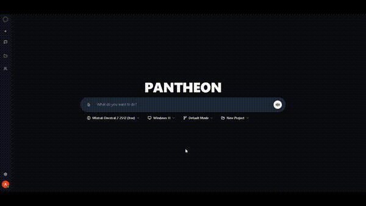

# Media Assets

This folder contains demo videos and media assets for Pantheon.

## Available Videos

- `platform-demo.mp4` - Main platform overview (full quality)
- `platform-demo-compressed.mp4` - Compressed version for GitHub
- `platform-demo-small.mp4` - Smaller version
- `platform-demo.gif` - GIF version
- `add-models.mp4` - Tutorial on adding AI models
- `add-models.gif` - GIF version
- `custom-modes.mp4` - Tutorial on custom modes
- `custom-modes.gif` - GIF version

## How to Add Videos to GitHub

### Method 1: GitHub Video Upload (Recommended)

1. Go to GitHub repository
2. Navigate to README.md
3. Click "Edit"
4. Drag and drop video file into editor
5. GitHub will upload and generate URL like:
   ```
   https://github.com/user-attachments/assets/your-video-id-here
   ```
6. Replace placeholder URL in README.md with generated URL
7. Commit changes

### Method 2: Use GIF Files

GIFs are already embedded in documentation:
- `docs/KEYCLOAK_SETUP.md` uses `custom-modes.gif`
- `docs/MODEL_CONFIGURATION.md` uses `add-models.gif`

### Method 3: External Hosting

Upload to YouTube, Vimeo, or Loom and embed:
```markdown
[](https://youtube.com/watch?v=VIDEO_ID)
```

## Video Specifications

### Current Videos

| File | Size | Resolution | Duration | Purpose |
|------|------|------------|----------|---------|
| platform-demo.mp4 | ~50MB | 1920x1080 | 2-3 min | Main demo |
| platform-demo-compressed.mp4 | ~10MB | 1280x720 | 2-3 min | GitHub upload |
| add-models.mp4 | ~20MB | 1920x1080 | 1 min | Model setup |
| custom-modes.mp4 | ~20MB | 1920x1080 | 1 min | Custom modes |

### Recommended Settings

- **Format**: MP4 (H.264 codec)
- **Resolution**: 1280x720 or 1920x1080
- **Frame Rate**: 30fps
- **File Size**: Under 10MB for GitHub
- **Duration**: 30 seconds to 2 minutes

## Compression Commands

### Compress Video for GitHub

```bash
# Compress to ~10MB
ffmpeg -i platform-demo.mp4 -vcodec h264 -acodec aac -b:v 1M -maxrate 1M -bufsize 2M platform-demo-compressed.mp4

# Smaller version
ffmpeg -i platform-demo.mp4 -vcodec h264 -acodec aac -b:v 500k -s 1280x720 platform-demo-small.mp4
```

### Convert to GIF

```bash
# High quality GIF
ffmpeg -i input.mp4 -vf "fps=15,scale=800:-1:flags=lanczos" output.gif

# Smaller GIF
ffmpeg -i input.mp4 -vf "fps=10,scale=600:-1:flags=lanczos" output.gif
```

## Usage in Documentation

### README.md

```markdown
## Platform Demo

https://github.com/user-attachments/assets/your-video-id-here

> Upload `media/platform-demo-compressed.mp4` to GitHub and replace the URL above.
```

### Other Documentation

```markdown

```

## Recording Tips

1. **Screen Recording Software**
   - Windows: OBS Studio, Camtasia
   - Mac: QuickTime, ScreenFlow
   - Linux: OBS Studio, SimpleScreenRecorder

2. **Recording Settings**
   - Resolution: 1920x1080
   - Frame rate: 30fps
   - Audio: Optional but recommended

3. **Content Guidelines**
   - Keep videos concise (under 2 minutes)
   - Show key features clearly
   - Use smooth mouse movements
   - Avoid sensitive information
   - Add captions if possible

4. **Post-Processing**
   - Trim unnecessary parts
   - Add intro/outro (optional)
   - Compress for web
   - Test playback

## Updating Videos

To update videos in documentation:

1. Record new video
2. Compress using commands above
3. Replace file in `media/` folder
4. If using GitHub upload, re-upload and update URL
5. Commit changes
6. Verify videos play correctly

## Support

For video issues:
- [GitHub Issues](https://github.com/akilhassane/pantheon/issues)
- [Discussions](https://github.com/akilhassane/pantheon/discussions)
